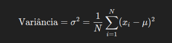
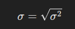
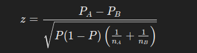

<h1 align="center">
  Desafio de Ciências de dados 
</h1>


# Exercício 1

## 1. Suponha que você possui uma base de dados rotulada com 10 classes não balanceadas, essa base é formada por 40 features de metadados e mais 3 de dados textuais abertos. 

### a. Descreva como faria a modelagem dessas classes 

Para a geração de uma pipeline para modelagem de classes neste problema, adotaria a metodologia CRISP-DM. Abaixo, detalho as etapas a serem seguidas:

 - #### 1. Entendimento dos objetivos do negócio

Inicialmente, focaria em entender os objetivos do negócio, estabelecendo um plano direcionado para responder às perguntas mais importantes.

- #### 2. Entendimento dos dados

Ao carregar os dados, faria uma análise exploratória para entendimento de todas as variáveis, identificando se as mesmas respondem às perguntas estabelecidas anteriormente. Caso não responda, tento buscar mais dados.

- #### 3. Preparação dos dados
Na preparação dos dados, incluiria as seguintes etapas:
- `Remoção de dados duplicados ou incompletos:` Limpeza de dados para garantir a qualidade.
- `Imputação de valores ausentes:` Substituição de valores ausentes por média, mediana, moda ou outras técnicas adequadas.
- `Tratamento de outliers:` Identificação e possível remoção de outliers.
- `Transformação de variáveis categóricas em numéricas:` Utilização de técnicas como one-hot encoding.
- `Representação de variáveis textuais:` Uso de TF-IDF ou embeddings (Word2Vec, BERT) para gerar representações vetoriais de palavras e sentenças.

- Como se trata de um problema com classes não balanceadas, adotaria técnicas para balanceamento das classes que podem ser:
- `Random Undersampling:` Remoção aleatória de dados da classe majoritária.
- `Clusterização e algoritmos de k-NN, NearMiss, etc.:` Fusão de observações de classes majoritárias.
- `Oversampling:` Criação sintética de novas observações da classe minoritária, utilizando técnicas como cópia dos dados existentes ou SMOTE (Synthetic Minority Over-sampling Technique).

- `Engenharia de variáveis:` Nesta etapa, poderia criar novas variáveis a partir das já existentes ou utilizar agregações temporais.

- `Seleção e particionamento dos dados:`Após a engenharia de variáveis, realizaria o particionamento dos dados em conjuntos de treinamento, validação e teste. 

- #### 4. Modelagem

Na modelagem,poderia utilizar validação cruzada (e.g., k-fold cross-validation) para avaliar o desempenho do modelo de forma robusta e reduzir o risco de overfitting. Compararia o desempenho de vários modelos utilizando redes neurais ou modelos de árvores. 

- #### Ferramentas Utilizadas

Para implementar esta pipeline, utilizaria Python como linguagem de programação e as seguintes bibliotecas:

- **Pandas:** Para manipulação e análise de dados.
- **NumPy:** Para operações matemáticas e de array.
- **Scikit-learn:** Para machine learning e ferramentas de modelagem.
- **NLTK ou SpaCy:** Para processamento de linguagem natural.

### b. Ao finalizar essa modelagem, como iria apresentar essa modelagem para a área contratante?
Primeiramente descreveria brevemente o problema que está sendo resolvido. Mostraria os resultados da análise exploratória , incluindo distribuição das classes e a identificação de valores faltantes, a proporção de cada classe. Compararia a performance dos modelos (XGBoost e Redes). Depois, brevemente explicaria as vantagens do modelo escolhido, apresentando as principais
métricas utilizadas para avaliar o desempenho do modelo (ex.: precisão, recall, F1-score).
Mostraria os resultados das métricas para o conjunto de teste, apresetando a matriz de confusão para visualizar os erros de classificação. Por fim, discutiria os principais tipos de erros cometidos pelo modelo. E sugeriria melhorias futuras para o modelo (ex.: ajuste de hiperparâmetros, coleta de mais dados, novas features). Abrindo espaço para perguntas e discussões, esclarecendo quaisquer dúvidas da área contratante.

### c. Como faria a validação desse modelo?

Para validação o conjunto de dados seria dividido em em dois conjuntos: um conjunto de treinamento e um conjunto de teste. O modelo seria treinado no conjunto de treinamento e avaliado no conjunto de teste. No conjunto de treinamento poderia ser aplicada a validação cruzada (K-Fold Cross-Validation). Que consiste em dividir os dados em k subconjuntos (folds). Funciona assim: o modelo treina em k-1 folds valida no fold restante. Depois o processo é repetido k vezes, cada vez usando um fold diferente para validação. O resultado final é a média das métricas de todas as k iterações.Para validação pode ser usado as métricas da matriz de confusão como acurácia, precisão, f1-score. Pode ser mostrada a curva ROC-AUC entre outras métricas de classificação. A biblioteca usada poderia ser a Scikit-Learn para validação cruzada e avaliação de métricas importando conforme abaixo:

```
from sklearn.model_selection import train_test_split, cross_val_score, StratifiedKFold
from sklearn.metrics import confusion_matrix, accuracy_score, precision_score, recall_score, f1_score, roc_auc_score, roc_curve

```

### d. Supondo que esses dados são recebidos diariamente, como iria trabalhar com esse desafio?

Para lidar com este desafio. Utilizaria ferramentas de  ETL (Extract, Transform, Load) para automatizar a ingestão de dados diários. Para isso é imporatnte gerar pipelines (por exemplo, Apache Airflow, Luigi) para importar, novos dados de várias fontes como APIs, bancos de dados, arquivos CSV, e escrever os dados em algum datalake disponível. Na parte de transformação dos dados deixaria salvo uma base de dados só com os dados que preciso já selecionados e tratados. Para acompanhamento da modelagem utilizaria ferramentas de gerenciamento do modelos como:MLflow, Kubeflow, Azure Machine Learning. Para avaliação dos modelos poderia utilizar dashboards para mostrar o desempenho historico a cada vez que fosse treinado o modelo. Poderia utilizar data studio ou power BI.

### e. Como levaria esse projeto para um ambiente produtivo?
Criaria uma pipeline de dados para limpar e transformar os dados brutos em um formato adequado para o modelo. Para isso utilizaria ferramentas como Apache Airflow, Luigi ou Kubeflow Pipelines para automatizar e orquestrar essas tarefas. Além disso, deixaria com schedule para que a pipeline processe os dados em horários específicos conforme a necessidade do negócio.Utilizaria ferramentas como MLflow, DVC ou Model Registry para versionar modelos e rastrear experimentos.

# Exercício 2

## Suponha que você tenha uma base de dados contendo textos jurídicos, como decisões judiciais, petições e documentos legais. A base de dados inclui informações sobre o conteúdo do texto, data, jurisdição e outras informações relevantes. Seu objetivo é criar um sistema de recomendação que sugira textos jurídicos semelhantes a um texto de referência.

### a. Descreva como você desenvolveria o sistema de recomendação que recebe um texto de referência e sugere os textos mais semelhantes a ele na base de dados.

Para desenvolver um sistema de recomendação que sugere textos jurídicos semelhantes a um texto de referência seguiria várias etapas antes implementação de algoritmos de similaridade. Entre elas tem-se:

- `Coleta e armazenamento de dados:` aqui éfeito uma estruturação da base de dados para armazenar textos jurídicos com metadados relevantes como conteúdo, data, jurisdição, tipo de documento. 

- `Pre-processamento dos textos:` envolve a limpeza dos dados, tokenização, remoção de Stop Words, lematização/stemming. 

- `Representação dos textos em vetores:` envolve tecnicas como: TF-IDF, Word Embeddings, Transformers.

- `Cálculo da similaridade:`  pode ser calculado utilizando medidas similaridade como cosseno, euclidiana, ou manhattan para calcular a similaridade entre o vetor do texto. 
Após essa etapa faria o desenvolvimento de uma função que recebe um texto de referência, faz o pré-processamento e vetorização dos textos, e calcula a similaridade com os textos na base de dados. E por fim, retorna os textos mais semelhantes com base nas medidas de similaridade calculadas.
Uma das bibliotecas mais completas para o processamento de linguagem natural (NLP) em Python é a NLTK (Natural Language Toolkit) poderia utilizar ela para trabalhar com esses problemas.

### b. Como você avaliaria esse sistema de recomendação? 
A avaliação pode ser realizada  utilizando tanto métricas quantitativas quanto qualitativas. Pode ser utilizado métricas quantitativas como precisão ( para ver proporção de documentos relevantes entre os recomendados), recall(para proporção de documentos relevantes recomendados em relação ao total de documentos relevantes) e f1-score (A média harmônica entre precisão e recall). E métrica qualitativas como: feedback de usuários (sobre relevância e utilidade das recomendações), realizando estudo de casos.

### c. Suponha que novos textos jurídicos sejam adicionados diariamente. Como você manteria o sistema de recomendação atualizado e garantiria que ele continue a fornece recomendações relevantes?

Seguiria as seguintes etapas: 
- `Ingestão de dados automatizada:` configuraria uma pipeline automatizada para ingestão de novos textos jurídicos diariamente. Utilize ferramentas como Apache Airflow, Apache NiFi ou serviços de integração de dados na nuvem (AWS Glue, Google Cloud Dataflow).
- `Pré-processamento automático:` automatizaria pré-processamento dos novos textos (limpeza, tokenização, remoção de stop words, lematização) para garantir que todos os textos estejam prontos para vetorização.
- `Atualização da representação de textos:` utilizaria embeddings como Word2Vec ou BERT, re-treinando os embeddings periodicamente ou utilizando embeddings pré-treinadas que possam ser ajustadas com os novos dados.
- `Monitoramento do desempenho:` implementaria monitoramento contínuo das métricas de desempenho do modelo, como precisão, recall, f1-score e outras métricas de relevância.

## TESTE 2

## O que é um desvio padrão e qual é o seu papel na medição da dispersão dos dados?
O desvio padrão é uma medida estatística que quantifica a dispersão ou a variabilidade de um conjunto de dados em relação à sua média. Indicando  o quanto os valores de um conjunto de dados se afastam, em média, da média aritmética (média) desse conjunto.

É a raiz da variância ao quadrado onde 

A variância  é calculada usando a seguinte fórmula:




Onde:
- \(N\) é o número total de dados
- \(xi\) são os valores dos dados
-  é a média dos dados

 Ele fornece uma estimativa quantitativa de quão espalhados os dados estão. Um desvio padrão alto indica que os dados estão amplamente distribuídos em torno da média, enquanto um desvio padrão baixo indica que os dados estão próximos da média.

##  Como funciona o teste de hipóteses e qual é a sua finalidade na análise estatística?

 O teste de hipóteses é um procedimento estatístico usado para tomar decisões sobre uma população com base em uma amostra de dados. Ele envolve formular uma hipótese inicial (hipótese nula) e determinar se os dados fornecem evidências suficientes para rejeitar essa hipótese em favor de uma hipótese alternativa. A finalidade do teste de hipóteses na análise estatística é avaliar se as observações em seus dados podem ser atribuídas ao acaso ou se há um efeito significativo que merece atenção.
 Passos no Teste de Hipóteses

- Etabeleça a hipótese nula (H0): É a hipótese que se tenta refutar.
Exemplo: A média da população é igual a um valor específico.
- Estabeleça a hipótese alternativa (H1): Afirma que há um efeito ou diferença.
Exemplo: A média da população é diferente de um valor específico.
- Escolha do nível de fignificância(f) é a probabilidade de rejeitar a hipótese nula quando ela é verdadeira (erro tipo I).

- Selecione o teste estatístico: Escolha do teste como teste t para médias, o teste qui-quadrado para proporções, entre outros.
- Cálcule do p-value que é a probabilidade de observar um resultado tão extremo quanto o obtido, assumindo que a hipótese nula é verdadeira.
- Decisão: Se o valor-p < f(nivel significância) rejeita-se a hipótese nula. Caso contrário não se rejeita a hiótese nula

### O que é aprendizado supervisionado e como ele difere do aprendizado não supervisionado?

O aprendizado supervisionado, é um apredizado de máquina em que o algoritmo é treinado em um conjunto de dados rotulados. Isso significa que cada exemplo de treinamento tem-se as correspondentes saídas ou rótulos. O objetivo é aprender uma função que mapeia entradas para saídas.e mede a diferença entre a saída predita pelo modelo e a saída real.O objetivo é aprender uma função que, dada uma nova entrada, possa prever a saída correspondente com precisão. Tarefas comuns de aprendizado supervisionado são: classificação (a saída é um valor discreto) e  regressão (a saída é um valor contínuo)

No aprendizado não supervisionado, o algoritmo é treinado em um conjunto de dados que não possui rótulos. O objetivo é inferir a estrutura ou padrões presentes nos dados. O objetivo é identificar agrupamentos, associações, encontrando padrões ocultos ou estruturas nos dados. Tarefas comuns são:  agrupamento de dados em subconjuntos onde itens no mesmo grupo são mais similares entre si do que aos itens de outros grupos e associação que é a descoberta de regras que descrevem grandes porções dos dados.

### O que é transfer learning e como ele é usado em deep learning?

Transfer learning, ou aprendizado por transferência, é uma técnica em machine learning onde um modelo desenvolvido para uma determinada tarefa é reutilizado como ponto de partida para um modelo em uma segunda tarefa. Em deep learning, essa abordagem é especialmente útil quando se trabalha com redes neurais profundas, que exigem grandes quantidades de dados e poder computacional para treinamento.Um modelo é treinado em uma grande base de dados e em uma tarefa que está relacionada de alguma forma à tarefa alvo. As camadas iniciais da rede neural, que geralmente aprendem características básicas como bordas e texturas no caso de imagens, são reutilizadas.As camadas finais, que são mais específicas da tarefa, podem ser ajustadas ou substituídas para se adaptar à nova tarefa.O modelo é adaptado à nova tarefa e, geralmente, treinado em uma base de dados menor e mais específica.O treinamento adicional pode ser feito ajustando apenas algumas camadas superiores da rede (camadas específicas da tarefa) enquanto as camadas inferiores (mais gerais) permanecem congeladas, ou pode envolver o ajuste de toda a rede com uma taxa de aprendizado menor. A transferência de aprendizado reduz significativamente o tempo de treinamento, pois não é necessário treinar a rede neural do zero. Envolve menor necessidade de grandes volumes de dados rotulados para a nova tarefa.

### Você está conduzindo um experimento A/B em um site de comércio eletrônico para determinar a eficácia de uma nova página de destino na conversão de visitantes em clientes. Como você projetaria o experimento, escolheria as métricas apropriadas para avaliação e realizaria a análise estatística para tirar conclusões significativas?

Para determinar se a nova página de destino (Página B) é mais eficaz em converter visitantes em clientes comparada à página atual (Página A). Criaria a Hipótese Nula (H0)
: A nova página de destino não altera a taxa de conversão em comparação com a página atual. A
Hipótese Alternativa (H1): A nova página de destino altera a taxa de conversão em comparação com a página atual.Amostragem: Dividir aleatoriamente os visitantes do site em dois grupos: Grupo A (controle) e Grupo B (tratamento).Grupo A verá a página de destino atual.Grupo B verá a nova página de destino.Calcularia a taxa de conversão: proporção de visitantes que realizam uma compra (Número de conversões/Número total de visitantes).Implementaria um sistema para rastrear visitas, cliques, conversões e outras métricas relevantes.Garantir que a coleta de dados seja consistente e precisa para ambos os grupos. Calcular a taxa de conversão, valor médio do pedido, taxa de rejeição e tempo no site para ambos os grupos.



Onde Pa e Pb são as taxas de conversão observadas nos grupos A e B, e na e nb
  são os tamanhos das amostras dos grupos A e B.
  Comparar o valor-p obtido com o nível de significância 
(geralmente 0,05) para decidir se a hipótese nula deve ser rejeitada. Se a hipótese nula for rejeitada, concluiria que a nova página de destino tem um impacto significativo na taxa de conversão.Se a hipótese nula não for rejeitada, concluiria que não há evidências suficientes para afirmar que a nova página de destino é mais eficaz. Exemplo abaixo

```
import numpy as np
from statsmodels.stats.proportion import proportions_ztest

# Dados de exemplo
# Número de visitantes e número de conversões para os grupos A e B
n_A = 1000
conversoes_A = 200
n_B = 1000
conversoes_B = 220

# Taxas de conversão
p_A = conversoes_A / n_A
p_B = conversoes_B / n_B

# Combinar os dados para o teste z
count = np.array([conversions_A, conversions_B])
nobs = np.array([n_A, n_B])

# Realizar o teste z para proporções
z_stat, p_value = proportions_ztest(count, nobs, alternative='two-sided')

print(f'Z-statistic: {z_stat:.2f}')
print(f'P-value: {p_value:.5f}')

# Resultado
if p_value < 0.05:
    print("Rejeitar a hipótese nula: A nova página de destino tem um impacto significativo na taxa de conversão.")
else:
    print("Não rejeitar a hipótese nula: Não há evidências suficientes para afirmar que a nova página de destino é mais eficaz.")

```

### Após realizar um teste ANOVA e obter um valor de F significativo, como você determinaria quais grupos são estatisticamente diferentes entre si?

Quando você realiza um teste ANOVA (Análise de Variância) e obtém um valor F significativo, isso indica que há pelo menos uma diferença estatisticamente significativa entre as médias dos grupos. No entanto, o teste ANOVA não informa quais grupos específicos diferem entre si. Para identificar esses grupos, você precisa realizar um teste post hoc. Escolhe um Teste Post Hoc:
- Teste de Tukey (Tukey's HSD): É o mais comum para comparações múltiplas e controla bem o erro tipo I.
- Teste de Bonferroni: É mais conservador e ajusta os níveis de significância com base no número de comparações. 
- Teste de Scheffé: É flexível e pode ser usado para comparações complexas, mas é mais conservador.

### Suponha que você tenha um conjunto de dados com três ou mais grupos para comparar e deseja determinar se há diferenças significativas entre eles. Descreva como você escolheria entre o teste ou outras técnicas estatísticas

Primeiramente entenderiaa distribuição dos dados dados. Se os dados não seguem uma distribuição normal, deve-se considerar alternativas aos testes paramétricos, como testes não paramétricos.  Se os dados atendem aos pressupostos do teste ANOVA (normalidade, homogeneidade de variâncias), pode-se prosseguir com esse teste. Caso contrário, pode-se considerar transformações nos dados ou explorar alternativas.Se os dados seguem uma distribuição normal e as variâncias entre os grupos são homogêneas, a ANOVA pode ser apropriada.Se os dados não atendem aos pressupostos da ANOVA, pode-se considerar testes não paramétricos, como o teste de Kruskal-Wallis. Este teste é uma alternativa à ANOVA quando os dados não são normalmente distribuídos. Além disso, pode-se realizar testes post hoc (como o teste de Tukey, teste de Bonferroni, etc.) para determinar quais grupos diferem entre si.Independentemente do teste escolhido, é importante interpretar os resultados com cautela.

### Qual é a importância do pré-processamento de texto em tarefas de NLP? Quais são as etapas comuns no pré-processamento de texto?

O pré-processamento de texto desempenha um papel importante nas tarefas de processamento de Linguagem Natural (NLP) por várias razões:

- Limpeza de dados: Os dados textuais geralmente contêm ruídos, como pontuação, caracteres especiais, tags HTML, que não são relevantes para a análise. O pré-processamento ajuda a remover esses ruídos, 
- Normalização: O texto pode conter variações na capitalização, ortografia e formas de palavras. A normalização padroniza essas variações para garantir consistência e facilitar a comparação entre textos.
- Tokenização: A tokenização envolve dividir o texto em unidades menores, como palavras ou subpalavras. Isso é fundamental para muitas tarefas de NLP, pois permite analisar o texto em nível de palavra.

- Remoção de stopwords: Stopwords são palavras comuns que não contribuem significativamente para o significado do texto (por exemplo, "a", "um", "de"). Remover stopwords pode reduzir o ruído nos dados e melhorar o desempenho de muitos algoritmos de NLP.

- Stemming e lematização: Ambos os processos reduzem as palavras às suas formas básicas, removendo sufixos e prefixos. Isso ajuda a agrupar palavras relacionadas e reduz a dimensionalidade do vocabulário.

- Vetorização: Muitos modelos de aprendizado de máquina em NLP exigem que os dados de texto sejam convertidos em representações numéricas. A vetorização transforma o texto em vetores numéricos, como Bag of Words (BoW), TF-IDF (Term Frequency-Inverse Document Frequency) ou word embeddings.

### Descreva o processo de vetorização de texto e como modelos de linguagem como o Word2Vec ou o TF-IDF podem ser usados para representar palavras e documentos.

A vetorização de texto é o processo de converter texto em representações numéricas que possam ser compreendidas e processadas por algoritmos de aprendizado de máquina. Existem várias técnicas de vetorização de texto: TF-IDF (Term Frequency-Inverse Document Frequency) e word embeddings, como o Word2Vec. 

- TF-IDF (Term Frequency-Inverse Document Frequency):

Term Frequency (TF): Mede a frequência com que um termo específico aparece em um documento. É calculado como o número de vezes que o termo aparece dividido pelo número total de termos no documento.

- Inverse Document Frequency (IDF): Mede a importância de um termo em relação ao conjunto de documentos. É calculado como o logaritmo do número total de documentos dividido pelo número de documentos que contêm o termo. 

- Word2Vec: É uma técnica de representação de palavras que mapeia palavras para vetores densos de números reais em um espaço de alta dimensão, onde palavras semelhantes estão próximas no espaço vetorial. Esses vetores são aprendidos de forma não supervisionada a partir de grandes corpora de texto.

- Word Embeddings pré-treinados: Modelos como o Word2Vec geralmente são treinados em grandes conjuntos de dados de texto, como a Wikipedia ou grandes coleções de documentos, para capturar relacionamentos semânticos entre palavras.


O resultado é uma representação numérica densa de cada palavra (ou documento) em um espaço vetorial, onde a proximidade espacial reflete relações semânticas entre as palavras. O TF-IDF é útil para modelar a importância de termos específicos em documentos individuais, enquanto os word embeddings como o Word2Vec são eficazes na captura de semântica e contexto das palavras em um espaço vetorial contínuo. Dependendo da tarefa específica e do conjunto de dados disponível, uma ou ambas as técnicas podem ser usadas para representar palavras e documentos em NLP.

### Como você lidaria com problemas de desequilíbrio de classe em tarefas de classificação de texto em NLP? Quais estratégias seriam eficazes?

Para lidar com este problema poderia utilizar 

Subamostragem (undersampling): Reduzir o número de instâncias da classe majoritária para equilibrar a distribuição das classes.
Superamostragem (oversampling): Aumentar o número de instâncias da classe minoritária, por exemplo, usando técnicas como duplicação de instâncias, geração sintética de dados (por exemplo, SMOTE - Synthetic Minority Over-sampling Technique) ou bootstraping.
Ponderação de classe:

Atribuir pesos diferentes às classes durante o treinamento do modelo para compensar o desequilíbrio. Por exemplo, atribuir pesos mais altos à classe minoritária e pesos mais baixos à classe majoritária.
Em vez de métricas de avaliação padrão como acurácia, que podem ser enganosas em conjuntos de dados desequilibrados, é melhor usar métricas que levem em consideração o desequilíbrio, como precisão, recall, F1-score e área sob a curva ROC (AUC-ROC).
Ao lidar com problemas de desequilíbrio de classe em tarefas de classificação de texto em NLP, a escolha da estratégia adequada depende da natureza dos dados, da quantidade de dados disponíveis e das restrições computacionais. Experimentar diferentes abordagens e ajustar conforme necessário é essencial para obter os melhores resultados.